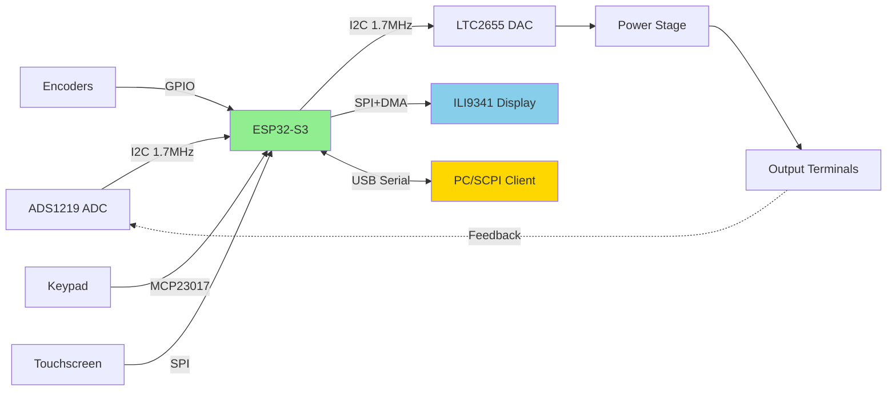

# ESP32-S3 Precision Power Supply

<div align="center">


**A high-precision, SCPI-enabled laboratory power supply with touchscreen interface**

[Features](#-features) • [Hardware](#-hardware-specifications) • [Quick Start](#-quick-start) • [Documentation](#-documentation) • [Development](#-development)

</div>

---

## 📋 Table of Contents

- [Overview](#-overview)
- [Features](#-features)
- [Hardware Specifications](#-hardware-specifications)
- [System Architecture](#-system-architecture)
- [Quick Start](#-quick-start)
- [User Interface](#-user-interface)
- [SCPI Commands](#-scpi-commands)
- [Calibration](#-calibration)
- [Development](#-development)
- [Contributing](#-contributing)
- [License](#-license)

---

## 🎯 Overview

This project implements a precision programmable power supply using the ESP32-S3 microcontroller. It features:

- **24-bit ADC** precision voltage/current measurement (ADS1219)
- **16-bit DAC** control (LTC2655)
- **3.2" TFT touchscreen** with LVGL graphics (320x240 ILI9341)
- **Dual rotary encoders** for precise control
- **Matrix keypad** for direct value entry
- **SCPI over USB Serial** for remote control
- **Real-time graphing** and statistics
- **INL calibration** for enhanced accuracy

### Key Capabilities

```
Voltage Range:    0 - 32.768V
Current Range:    0 - 5.000A (switchable to mA mode for precision)
Measurement:      24-bit resolution
Control:          16-bit DAC resolution
Update Rate:      Up to 1000 SPS ADC sampling
Interface:        Touchscreen + Encoders + Keypad + SCPI
```

---

## ✨ Features

### 🔬 Measurement & Control

- **High-Precision ADC**: 24-bit ADS1219 with four selectable sample rates (20, 90, 330, 1000 SPS)
- **Dual-Range Current**: Automatic A/mA switching for optimal precision
- **Real-Time Statistics**: Mean, StdDev, Min, Max, ENOB calculation
- **Histogram Display**: Real-time distribution visualization
- **Graph Recorder**: 1024-point voltage/current chart with time/points mode
- **CC/CV Detection**: Automatic constant current/voltage mode detection
- **REL Mode**: Keithley-style relative current measurement

### 🎛️ User Interface

- **5 Pages**: Main, Graph, Histogram, Utility, Settings
- **Touch + Encoders**: Dual rotary encoders for voltage/current adjustment
- **Matrix Keypad**: Direct numeric entry with unit parsing (V, mV, A, mA)
- **Color-Coded Status**: Visual feedback for OFF/CV/CC/FUN modes
- **Live Bar Graphs**: Animated bars with min/max markers
- **Responsive Design**: Optimized LVGL rendering with DMA acceleration

### 🔧 Advanced Functions

- **Function Generator**: 18 waveform types (sine, triangle, square, pulse, etc.)
- **INL Calibration**: Integral Non-Linearity correction with cubic interpolation
- **Multi-Bank Memory**: Save/load 20 preset configurations
- **OVP/OCP**: Software over-voltage/over-current protection with beeper alert
- **Energy Counter**: Cumulative Wh tracking with persistent storage
- **Timer**: Auto-shutdown after configurable duration
- **Auto-Save**: Periodic setting backup to flash

### 📡 Remote Control

- **SCPI Interface**: IEEE 488.2 and SCPI-1999 compliant
- **USB Serial**: 115200 baud, plug-and-play
- **40+ Commands**: Full control via :SOURce, :MEASure, :OUTPut, :SYSTem subsystems
- **Error Queue**: Standard SCPI error reporting
- **Self-Test**: Comprehensive *TST? diagnostics (11 tests)

---

## 🔩 Hardware Specifications

### Core Components

| Component | Part Number | Description |
|-----------|-------------|-------------|
| **MCU** | ESP32-S3-N16R8 | Dual-core 240MHz, 16MB Flash, 8MB PSRAM |
| **ADC** | ADS1219 | 24-bit, 4-channel, I2C, ±2.048V reference |
| **DAC** | LTC2655 | 16-bit, 4-channel, I2C, internal reference |
| **Display** | ILI9341 | 320x240 TFT with resistive touch |
| **I/O Expander** | MCP23017 | 16-bit GPIO for keypad matrix |
| **Encoders** | 2x Rotary | Quadrature with push button |

### Pinout

```
ESP32-S3 Pin Assignments:
├── I2C1 (ADC):        SDA=17, SCL=18 @ 1.7MHz
├── I2C2 (DAC/Keys):   SDA=15, SCL=16 @ 1.7MHz
├── SPI (Display):     MOSI=11, MISO=13, CLK=12, CS=10, DC=14
├── Touch:             XPT2046 via display controller
├── Encoder1 (Volt):   A=5, B=4
├── Encoder2 (Curr):   A=7, B=6
├── ADC Ready:         GPIO9 (interrupt)
├── CC/CV Detect:      Analog input pin
└── A/mA Range:        GPIO output (relay control)
```

### I2C Address Map

```
Wire (Bus 2):  0x20 - MCP23017 (Keypad)
               0x41 - LTC2655 (DAC)

Wire1 (Bus 1): 0x40 - ADS1219 (ADC)
```

---

## 🏗️ System Architecture

### Task Structure (FreeRTOS)

```
┌─────────────────────────────────────────────────────────┐
│                      Core 0                             │
├─────────────────────────────────────────────────────────┤
│  Task_adc (Priority 1)                                  │
│  ├── ADC sampling @ interrupt rate (20-1000 SPS)        │
│  ├── Voltage/Current measurement processing             │
│  ├── INL calibration correction                         │
│  ├── Histogram updates                                  │
│  ├── Graph data recording                               │
│  ├── DAC output updates (100Hz normal, 200Hz fgen)      │
│  └── Keyboard/Encoder input polling                     │
│                                                          │
│  Task_BarGraph (Priority 0)                             │
│  └── Bar graph rendering (main page only)               │
└─────────────────────────────────────────────────────────┘

┌─────────────────────────────────────────────────────────┐
│                      Core 1                             │
├─────────────────────────────────────────────────────────┤
│  Main Loop                                              │
│  ├── SCPI command processing                            │
│  ├── LVGL timer handler (UI rendering)                  │
│  ├── Status bar updates                                 │
│  ├── Power management (timer, energy, limits)           │
│  ├── Memory monitoring                                  │
│  ├── Statistics calculation                             │
│  └── Encoder interaction routing                        │
└─────────────────────────────────────────────────────────┘
```

### Data Flow



### Software Layers

```
┌──────────────────────────────────────────────────┐
│            Application Layer                     │
│  ┌────────────┬──────────┬────────────────────┐  │
│  │ UI Pages   │  SCPI    │  Function Gen      │  │
│  │ (5 tabs)   │  Parser  │  (18 waveforms)    │  │
│  └────────────┴──────────┴────────────────────┘  │
├──────────────────────────────────────────────────┤
│            Business Logic                        │
│  ┌────────────┬──────────┬────────────────────┐  │
│  │ Calibration│  Power   │  Memory Management │  │
│  │ (ADC/DAC)  │  Mgmt    │  (Presets/Energy)  │  │
│  └────────────┴──────────┴────────────────────┘  │
├──────────────────────────────────────────────────┤
│            Device Abstraction                    │
│  ┌────────────┬──────────┬────────────────────┐  │
│  │ Device     │DispObject│  Statistics        │  │
│  │ (Central)  │ (Volt/I) │  (Histogram/FFT)   │  │
│  └────────────┴──────────┴────────────────────┘  │
├──────────────────────────────────────────────────┤
│            Hardware Drivers                      │
│  ┌────────────┬──────────┬────────────────────┐  │
│  │ ADS1219    │ LTC2655  │  TFT_eSPI/LVGL     │  │
│  │ ESP32Enc   │ Keypad   │  I2C Recovery      │  │
│  └────────────┴──────────┴────────────────────┘  │
├──────────────────────────────────────────────────┤
│            Hardware (ESP32-S3 + Peripherals)     │
└──────────────────────────────────────────────────┘
```

---

## 🚀 Quick Start

### Prerequisites

- **PlatformIO** (VS Code extension or CLI)
- **ESP32-S3 board** with USB connection
- **Git** (for cloning repository)

### Installation

1. **Clone the repository**
   ```bash
   git clone https://github.com/yourusername/S3_PS_lvgl_8.4.git
   cd S3_PS_lvgl_8.4
   ```

2. **Build the project**
   ```bash
   ~/.platformio/penv/bin/pio run
   ```

3. **Upload to ESP32-S3**
   ```bash
   ~/.platformio/penv/bin/pio run --target upload
   ```

4. **Monitor serial output**
   ```bash
   ~/.platformio/penv/bin/pio device monitor --baud 115200
   ```

### First Power-On

1. **Touchscreen Calibration**: Touch corners when prompted (first boot only)
2. **ADC/DAC Calibration**: Go to Settings page → Calibration tab
3. **Set Voltage/Current**: Use encoders or touch keypad button for direct entry
4. **Enable Output**: Press ON/OFF button on main page

---

## 🖥️ User Interface

### Page Layout

```
┌─────────────────────────────────────────────────────┐
│  [Stats] [Graph] [Main] [Utility] [Settings]       │ ← Tabs
├─────────────────────────────────────────────────────┤
│                                                     │
│  ╔═══════════════════════════════════════════════╗ │
│  ║                                               ║ │
│  ║            Active Page Content                ║ │
│  ║                                               ║ │
│  ║         (Dynamically rendered based           ║ │
│  ║             on selected tab)                  ║ │
│  ║                                               ║ │
│  ╚═══════════════════════════════════════════════╝ │
│                                                     │
├─────────────────────────────────────────────────────┤
│  Status: VC  │  12.500V │ 1.523A │  19.04W        │ ← Status Bar
└─────────────────────────────────────────────────────┘
```

### Main Page

```
┌──────────────────────────────────────────────┐
│  V-Set: +12.5000V           [🔓]             │
│  ┌────────────────────────────────┐          │
│  │ ▓▓▓▓▓▓▓▓▓▓▓░░░░░░░░░░░░░░░░░░ │ ←Bar    │
│  └────────────────────────────────┘          │
│                +12.504V  ←Measured            │
│                                               │
│  I-Set: +01.5000A           [🔓]             │
│  ┌────────────────────────────────┐          │
│  │ ▓▓▓▓▓▓░░░░░░░░░░░░░░░░░░░░░░░ │          │
│  └────────────────────────────────┘          │
│                +01.523A                       │
│                                               │
│                +19.045W    [ON]  ←Button     │
│                0.123Wh   00:15:32 ←Counters  │
└──────────────────────────────────────────────┘
```

### Graph Page

```
┌──────────────────────────────────────────────┐
│  ┌────────────────────────────────────────┐  │
│ 32V│╱╲      ╱╲                            │  │
│    │ ╲    ╱  ╲    ╱╲                      │  │
│ 16V│  ╲  ╱    ╲  ╱  ╲                     │  │
│    │   ╲╱      ╲╱    ╲                    │  │
│  0V└────────────────────────────────────→  │  │
│         60s   30s    0s      Time          │  │
│  └────────────────────────────────────────┘  │
│  ━ Voltage (Blue)  ━ Current (Amber)        │
│  [═══════════Zoom══════════] ←Sliders       │
└──────────────────────────────────────────────┘
```

### Keyboard Entry

```
Touch "V-Set" or "I-Set" label to open numeric keypad:

┌──────────────────────┐
│   12.5█              │ ←Input
│  ┌───┬───┬───┬───┐   │
│  │ 7 │ 8 │ 9 │ ← │   │
│  ├───┼───┼───┼───┤   │
│  │ 4 │ 5 │ 6 │ V │   │
│  ├───┼───┼───┼───┤   │
│  │ 1 │ 2 │ 3 │mV │   │
│  ├───┼───┼───┼───┤   │
│  │ 0 │ . │ ✓ │ A │   │
│  └───┴───┴───┴───┘   │
│  Units: V/mV/A/mA    │
└──────────────────────┘
```

---

## 📡 SCPI Commands

### Quick Reference

Full documentation: [SCPI_Commands.md](docs/SCPI_Commands.md)

#### Basic Control

```python
import serial

ser = serial.Serial('/dev/ttyACM0', 115200)

# Identify instrument
ser.write(b'*IDN?\n')
print(ser.readline())  # → Anthropic,ESP32-PS,348518908788,v0.0.2

# Set voltage and current
ser.write(b':SOUR:VOLT 12.5\n')
ser.write(b':SOUR:CURR 1.5\n')

# Enable output
ser.write(b':OUTP:STAT ON\n')

# Read measurements
ser.write(b':MEAS:VOLT?\n')
print(ser.readline())  # → 12.504523

ser.write(b':MEAS:CURR?\n')
print(ser.readline())  # → 1.523412

# Disable output
ser.write(b':OUTP:STAT OFF\n')
```

#### Command Categories

| Subsystem | Commands | Purpose |
|-----------|----------|---------|
| **IEEE 488.2** | `*IDN?`, `*RST`, `*CLS`, `*TST?` | Standard common commands |
| **:SOURce** | `:VOLT`, `:CURR`, `:FUNC` | Output control |
| **:MEASure** | `:VOLT?`, `:CURR?`, `:POW?` | Measurement queries |
| **:OUTPut** | `:STAT`, `:PROT:CLE` | Output enable/protection |
| **:SYSTem** | `:ERR?`, `:BEEP`, `:CAP?` | System functions |
| **:CALibration** | `:SAVE`, `:LOAD`, `:STAT?` | Calibration management |

### Error Handling

```python
# Always check for errors after commands
ser.write(b':SOUR:VOLT 99999\n')  # Invalid value

ser.write(b':SYST:ERR?\n')
error = ser.readline()
print(error)  # → -222,"Data out of range"
```

---

## 🎯 Calibration

### ADC Calibration (Voltage)

1. **Navigate**: Settings → Calibration → ADC Voltage
2. **Two-Point Method**:
   - **Point 1**: Apply 0.000V → Click "Measure V1" → Click "Measure C1"
   - **Point 2**: Apply 32.000V → Click "Measure V2" → Click "Measure C2"
3. **Save**: Click "Save" to write to flash

### INL Calibration (Enhanced Accuracy)

For <0.01% accuracy, perform multi-point INL calibration:

1. **Settings → INL Calibration**
2. **Multi-Point Sweep**: Applies 0V to 32.5V in steps
3. **Automated**: Uses external DMM for reference (connect via SCPI)
4. **Algorithm**: Monotone cubic interpolation builds correction curve
5. **Result**: Corrects ADC non-linearity across full range

**Before INL**: ±0.05% accuracy
**After INL**: ±0.005% accuracy (10x improvement)

### Calibration Storage

```
Flash (NVS):
├── CalibrationV: Voltage ADC coefficients
├── CalibrationI: Current ADC coefficients
├── dac_data_: DAC zero/span codes
├── adc_inl_measure: INL measured points
└── adc_inl_ideal: INL ideal reference
```

---

## 🛠️ Development

### Project Structure

```
S3_PS_lvgl_8.4/
├── src/
│   ├── main.cpp                 # Entry point
│   ├── device.cpp/.hpp          # Central Device class
│   ├── DispObject.cpp/.h        # Voltage/Current display objects
│   ├── tasks.cpp/.h             # FreeRTOS task definitions
│   ├── intervals.cpp/.h         # Periodic update functions
│   ├── input_handler.cpp/.h     # Encoder/keypad/touch handling
│   ├── ui_creation.cpp/.h       # LVGL UI initialization
│   ├── ui_helpers.cpp/.h        # UI event callbacks
│   ├── scpi_parser.cpp/.h       # SCPI command parser
│   ├── power_management.cpp/.h  # Timer/energy/limits
│   ├── calib_*.cpp/.h           # Calibration modules
│   ├── waveform_generator.cpp/.h# Function generator
│   ├── LTC2655.cpp/.h           # DAC driver
│   ├── FFTHandler.cpp/.h        # FFT for waveforms
│   ├── setting_menu.cpp/.h      # Settings UI
│   ├── globals.cpp/.h           # Global variables
│   ├── config.cpp/.hpp          # Hardware config
│   └── version.h                # Auto-generated version
│
├── lib/
│   ├── TFT_eSPI/                # Display driver
│   ├── lvgl/                    # Graphics library v8.4
│   ├── ADS1219/                 # ADC library
│   └── ESP32Encoder/            # Rotary encoder library
│
├── docs/
│   ├── SCPI_Commands.md         # SCPI reference
│   ├── Calibration_Guide.md     # Calibration procedures
│   └── Hardware_Schematic.pdf   # Circuit diagrams
│
├── platformio.ini               # Build configuration
├── CLAUDE.md                    # Development guidelines
└── README.md                    # This file
```

### Build Configuration

**platformio.ini key settings:**

```ini
[env:esp32-s3-devkitc-1]
platform = espressif32
board = esp32-s3-devkitc-1
framework = arduino

build_flags =
    -O3                          # Max optimization
    -std=gnu++2a                 # C++20
    -D RELEASE
    -D LV_CONF_INCLUDE_SIMPLE
    -D LGFX_USE_V1

lib_deps =
    bodmer/TFT_eSPI @ ^2.5.43
    lvgl/lvgl @ ^8.4.0
    # ... more dependencies

board_build.flash_mode = qio
board_build.partitions = huge_app.csv
```

### Adding a New UI Page

1. **Add page object** to `PowerSupply.page[]` array
2. **Create UI** in `ui_creation.cpp` using `lv_tabview_add_tab()`
3. **Add handler** in `input_handler.cpp` (follow existing pattern)
4. **Register handler** in `managePageEncoderInteraction()` switch
5. **Add keyboard shortcuts** in `keyCheckLoop()` if needed

### Adding a Waveform

```cpp
// In waveform_generator.cpp

// 1. Define waveform function (t ∈ [0,1])
double my_custom_wave(double t) {
    return 0.5 + 0.5 * sin(2 * PI * t * 5);  // Example: 5 cycles
}

// 2. Add to waveforms array
Waveform waveforms[] = {
    // ... existing waveforms ...
    {"My Custom", my_custom_wave},
};
```

Table auto-populates from array!

### Coding Standards

- **Naming**:
  - Classes: `PascalCase` (`Device`, `DispObject`)
  - Functions: `camelCase` (`keyCheckLoop`, `handleGraphPage`)
  - Files: `snake_case` (`input_handler.cpp`, `waveform_generator.cpp`)
- **Indentation**: 4 spaces
- **Comments**: Doxygen-style for public APIs
- **Testing**: Always test on hardware after UI changes
- **Commits**: Descriptive messages with 🤖 Claude Code footer

---

## 📊 Performance Metrics

### Real-World Benchmarks

| Metric | Value |
|--------|-------|
| **ADC Sampling** | Up to 1000 SPS (both channels) |
| **DAC Update** | 100 Hz (normal), 200 Hz (fgen) |
| **UI Refresh** | 30-60 FPS (adaptive) |
| **SCPI Latency** | <10ms per command |
| **Boot Time** | ~3 seconds |
| **Calibration Save** | ~50ms |
| **Memory Usage** | 180KB RAM, 2.1MB Flash |

### Optimization Results (v0.0.2-142)

Recent optimizations achieved:
- ✅ 2-3x faster UI responsiveness
- ✅ 99% reduction in graph update overhead
- ✅ 95% faster calibration save/load
- ✅ Eliminated memory leaks in encoder handling
- ✅ Fixed race condition in ADC task

---

## 🤝 Contributing

We welcome contributions! Please follow these guidelines:

### Reporting Issues

1. **Check existing issues** first
2. **Provide details**: Hardware version, steps to reproduce, expected vs actual behavior
3. **Include logs**: Serial monitor output, screenshots if UI-related

### Pull Requests

1. **Fork the repository**
2. **Create feature branch**: `git checkout -b feature/my-awesome-feature`
3. **Commit incrementally**: Small, logical commits with clear messages
4. **Test on hardware**: Verify your changes work on actual device
5. **Update documentation**: README, SCPI docs, comments as needed
6. **Submit PR**: Clear description of what changed and why

### Development Setup

```bash
# Clone your fork
git clone https://github.com/yourusername/S3_PS_lvgl_8.4.git
cd S3_PS_lvgl_8.4

# Install PlatformIO
pip install platformio

# Build and upload
pio run --target upload

# Monitor output
pio device monitor --baud 115200
```

---

## 📜 License

This project is licensed under the MIT License - see [LICENSE](LICENSE) file for details.

---

## 🙏 Acknowledgments

### Libraries Used

- [LVGL](https://lvgl.io/) - Embedded graphics library
- [TFT_eSPI](https://github.com/Bodmer/TFT_eSPI) - Fast TFT library
- [ESP32Encoder](https://github.com/madhephaestus/ESP32Encoder) - Rotary encoder library
- [ADS1219](https://github.com/OM222O/ADS1219) - ADC driver
- [Keypad_MC17](https://github.com/joeyoung/arduino_keypads) - Matrix keypad library

### Inspiration

- **Keithley 2400** - Professional source meter design patterns
- **Rigol DP832** - User interface layout inspiration
- **SCPI Consortium** - Standard command structure

### Special Thanks

- **Anthropic Claude Code** - AI-assisted development and code optimization
- **ESP32 Community** - Invaluable forums and resources
- **Open Source Contributors** - All library authors and maintainers

---

## 📞 Support

- **Issues**: [GitHub Issues](https://github.com/yourusername/S3_PS_lvgl_8.4/issues)
- **Documentation**: [Wiki](https://github.com/yourusername/S3_PS_lvgl_8.4/wiki)
- **Email**: your.email@example.com

---

## 🗺️ Roadmap

### Current Version (v0.0.2-142)
- ✅ Core power supply functionality
- ✅ SCPI remote control
- ✅ INL calibration
- ✅ Function generator
- ✅ Energy counter & timer

### Planned Features (v0.1.0)
- 🔄 Data logging to SD card
- 🔄 Voltage/current sequencing
- 🔄 Built-in IV curve tracer
- 🔄 WiFi connectivity (web UI)
- 🔄 Battery charge profiles

### Future Ideas (v0.2.0+)
- 💡 USB-C PD integration
- 💡 Bluetooth LE control
- 💡 Multi-channel expansion
- 💡 Thermocouple input support
- 💡 LXI protocol support

---

<div align="center">

**Made with ❤️ and precision engineering**

[⬆ Back to Top](#esp32-s3-precision-power-supply)

</div>
